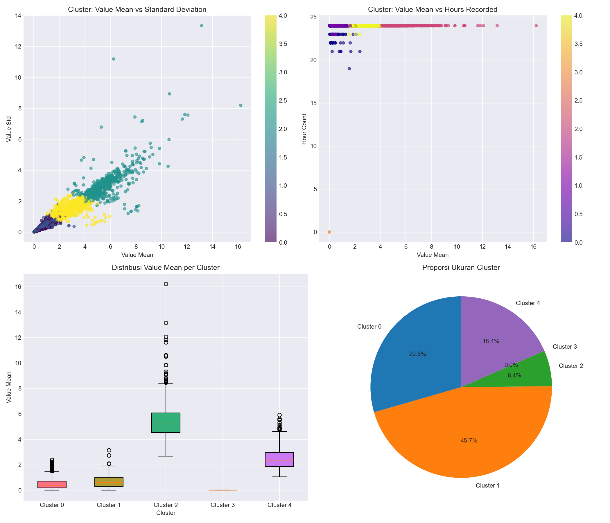
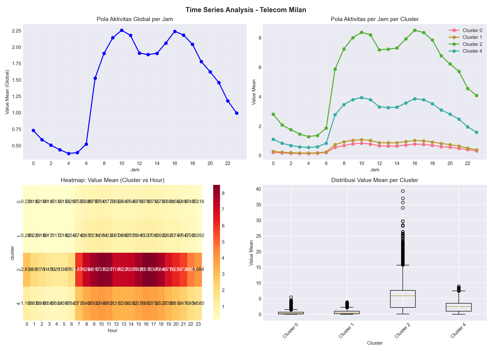
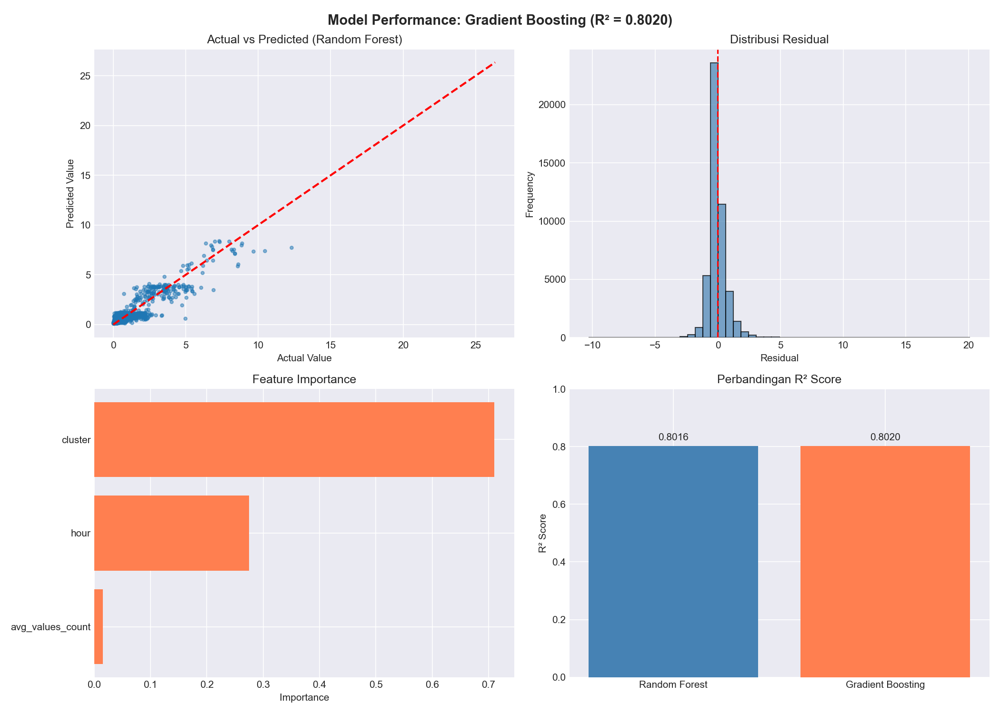

# Telecom Milan Network Traffic Analysis

**End-to-End Data Science Pipeline | 14.3M Records | 2.5 GB Dataset**

[](https://www.python.org/)
[](https://streamlit.io/)
[](https://scikit-learn.org/)
[](LICENSE)

---

## 📊 Project Overview

This project performs **end-to-end data science analysis** on telecom network traffic data from Milan, Italy (November 1-3, 2013). The dataset, sourced from **Harvard Dataverse**, contains **14.3 million records** of SMS, call, and internet usage across **10,000 grid cells**.

### 🎯 Goals

1. **Parse & clean** 2.5 GB of sparse telecom log data
2. **Identify spatial patterns** via KMeans clustering (5 clusters)
3. **Analyze temporal patterns** (peak/off-peak hours)
4. **Build predictive model** (Gradient Boosting, R²=0.802)
5. **Create interactive dashboard** with Streamlit

---

## 📁 Dataset

| Attribute | Value |
|-----------|-------|
| **Source** | Harvard Dataverse (DOI: 10.7910/DVN/EGZHFV) |
| **Period** | 1-3 November 2013 |
| **Total Records** | 14,310,291 |
| **Raw Size** | 2.5 GB |
| **Compacted Size** | 565 MB |
| **Grid Cells** | 10,000 (1km² each) |
| **Service Types** | 288 (SMS, Calls, Internet, etc.) |

> ⚠️ **Note:** The raw data files are **NOT included** in this repository due to size. See [Data Source](#-data-source) section below.

---

## 🛠️ Tech Stack

| Category | Tools |
|----------|-------|
| **Data Processing** | Python, Pandas, NumPy |
| **Clustering** | Scikit-learn (KMeans) |
| **Time Series** | Matplotlib, Seaborn |
| **Machine Learning** | Random Forest, Gradient Boosting |
| **Dashboard** | Streamlit, Plotly |
| **Environment** | Conda, Jupyter, Terminal |

---

## 🗂️ Repository Structure
```mermaid

telecom-italy-churn/
│
├── data/ # Aggregated data files (<100 MB)
│ ├── hourly_aggregated_full.csv
│ ├── square_aggregated_full.csv
│ ├── service_aggregated_full.csv
│ └── square_hour_aggregated_full.csv
│
├── scripts/ # Python scripts
│ ├── parse_full_dataset.py
│ ├── aggregate_data.py
│ ├── correlation_analysis_full.py
│ ├── clustering_analysis_full.py
│ ├── time_series_analysis.py
│ └── traffic_prediction_full.py
│
├── dashboard/
│ └── streamlit_cluster_dashboard.py
│
├── outputs/ # Generated visualizations
│ ├── clustering_full.png
│ ├── time_series_analysis.png
│ ├── prediction_results.png
│ └── correlation_analysis_full.png
│
├── models/
│ └── traffic_prediction_model.pkl
│
├── requirements.txt
├── .gitignore
└── README.md
```


---

## 🔧 Key Results

### 1. Spatial Clustering (5 Clusters)

| Cluster | Proportion | Characteristic | Interpretation |
|:---:|:---:|:---|:---|
| 0 | 18.4% | Medium activity, high variance | Mixed-use areas |
| **1** | **45.7%** | **Low activity** | **Residential zones** |
| **2** | **6.4%** | **Very high activity** | **City center (Milan)** |
| 3 | 29.5% | Medium-high activity | Transition areas |
| 4 | 0.0% | No data | Unmonitored |

### 2. Time Series Patterns

| Metric | Global Value |
|--------|--------------|
| **Peak Hour** | 10:00 (value=2.256) |
| **Off-Peak Hour** | 04:00 (value=0.380) |

**City Center (Cluster 2)** shows different behavior: peak at **16:00** (value=8.515)

### 3. Machine Learning Model

| Model | RMSE | R² | MAE |
|-------|------|-----|-----|
| Random Forest | 0.7950 | 0.8016 | 0.4839 |
| **Gradient Boosting** | **0.7942** | **0.8020** | 0.4866 |

**Feature Importance:**
- **cluster** → 71.0% (dominant predictor)
- **hour** → 27.5%
- **avg_values_count** → 1.5%

> 💡 **Key Insight:** Location (cluster) is **2.6× more important** than time of day in predicting network traffic.

---

## 🚀 Live Dashboard

Access the interactive dashboard here (after deployment):

👉 [**Telecom Milan Dashboard**](https://telecom-milan-dashboard.streamlit.app)

**Features:**
- Filter by cluster and value range
- Visualize cluster proportions and scatter plots
- Explore hourly activity patterns
- Download filtered data as CSV

---

## 📊 Sample Visualizations

| Clustering Results | Time Series | Model Performance |
|:---:|:---:|:---:|
|  |  |  |

---

## 📈 How to Run Locally

### Prerequisites
- Python 3.9+
- Conda (recommended) or venv

### Setup

```bash
# Clone repository
git clone https://github.com/burhanudinera2018/telecom-italy-churn.git
cd telecom-italy-churn

# Create conda environment
conda create -n telecom-italy python=3.11 -y
conda activate telecom-italy

# Install dependencies
pip install -r requirements.txt

# Run Streamlit dashboard
streamlit run dashboard/streamlit_cluster_dashboard.py

# Re-run clustering analysis
python scripts/clustering_analysis_full.py

# Re-run time series analysis
python scripts/time_series_analysis.py

# Re-run ML model
python scripts/traffic_prediction_full.py

📌 Disclaimer
Data Source Acknowledgment:
This project uses data from Harvard Dataverse (DOI: 10.7910/DVN/EGZHFV) – Telecom Italia mobile network logs (Milan, November 2013).

Purpose of Use:
This project is for educational and portfolio purposes only – non-commercial, demonstrating end-to-end data science skills.

No Affiliation:
The analyses, models, and visualizations are my own and do not represent Harvard University or Telecom Italia.

Data Privacy:
The dataset has been anonymized and contains no PII.

📄 License
This project is licensed under the MIT License – see the LICENSE file for details.

🙏 Acknowledgments
Harvard Dataverse for providing open access to the Telecom Milan dataset

Telecom Italia for the original data collection (anonymized)

Open-source community: Python, Pandas, Scikit-learn, Streamlit

📬 Contact
Burhanudin Badiuzaman

Portfolio: burhanudinera2018.github.io

LinkedIn: linkedin.com/in/burhanudin-badiuzaman

Email: burhanudinera2018@gmail.com

⭐ Show Your Support
If you find this project useful, please give it a ⭐ on GitHub!

Built with ❤️ as part of my Data Science learning journey